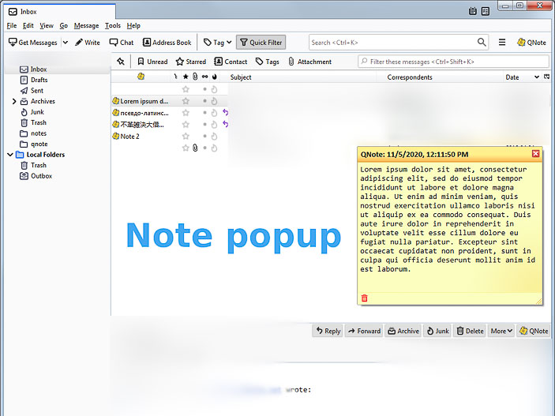
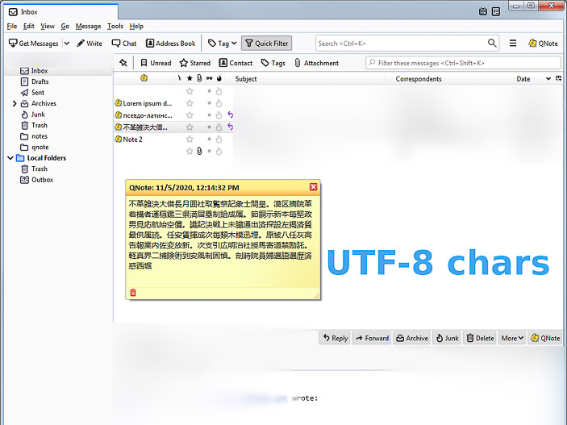
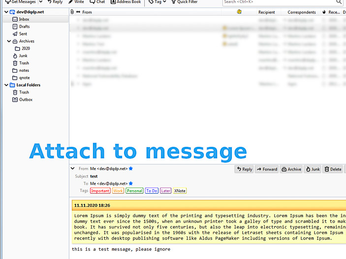
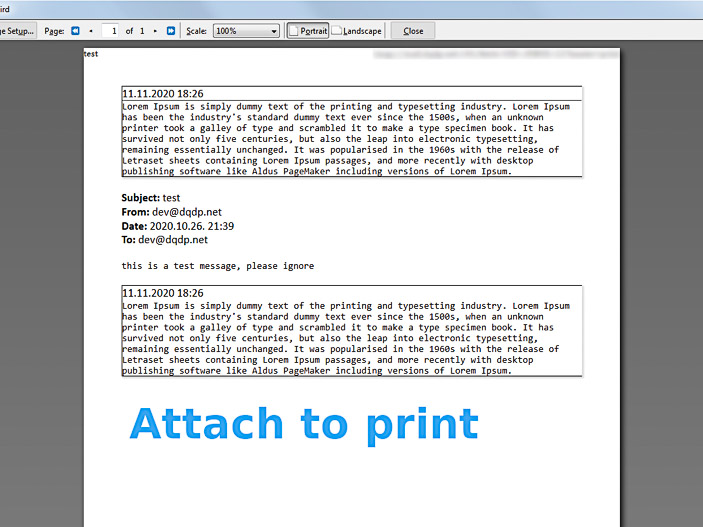
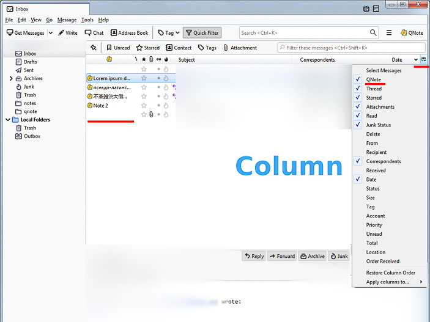
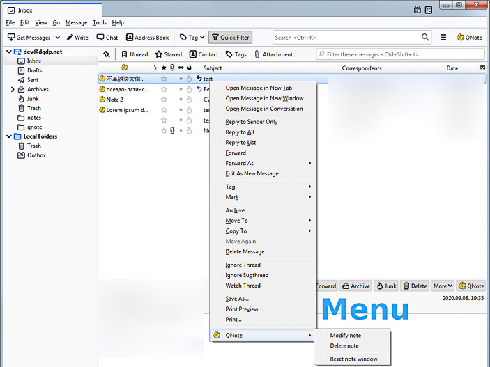
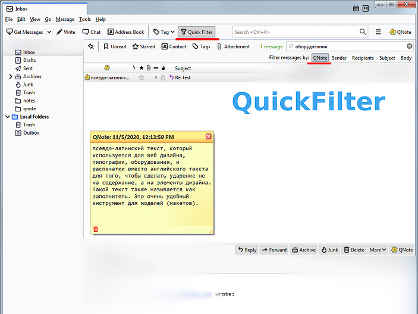
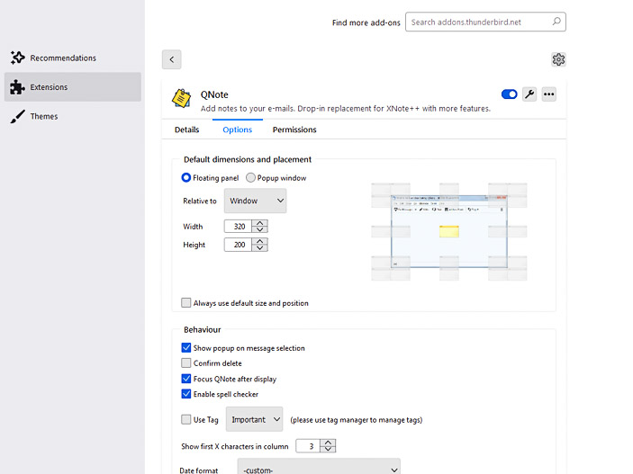
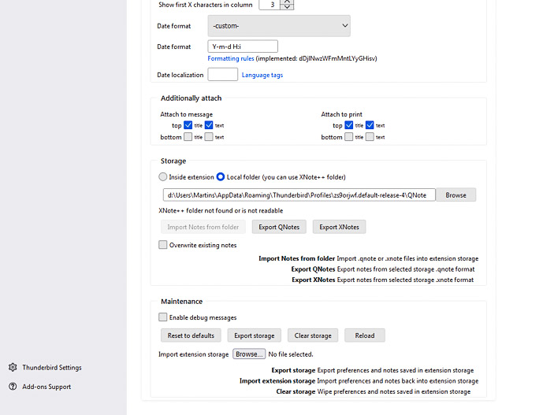

# Source code for Thunderbird [QNote](https://addons.thunderbird.net/en-US/thunderbird/addon/qnote/) add-on.

To install extension just zip whole folder and rename file's extension to .xpi and add it to Thunderbird.

# Features

- Add notes to e-mail messages
- Save note position, size, multiple default note positions
- Searchable notes via Thunderbird's QuickFilter
- Mail pane column with note icon and / or note preview
- Attach note to message body
- Attach note when printing
- Light / dark theme
- Multiple locales and localized date formats
- Auto tag message when adding note
- Fully <a href="https://addons.thunderbird.net/en-US/thunderbird/addon/xnotepp/">XNote++</a> compatible
- Import / export back to XNote++ format

# Usage

- Alt+Q to toggle note
- ESC to close note without saving
- Right click context menu to delete note or reset note window
- Use QuickFilter to search notes

# Storage

There are two options for storing notes:

- inside extension
- outside extension in folder

Currently storing notes outside extension is more versatile and preffered way. This enables seaching notes and sharing with different computers using sharing mechanism like Dropbox, NFS, Windows / Samba share, etc. You can also use XNote++ folder.

When modifying XNote++ notes (.xnote extension) these will be saved in more versatile JSON format (.qnote extension).

# Popup windows

There are two options for note window:

- Floating panel
- Popup window

_Floating panel_ has nicer looks but does not display well on MacOS. Fall back to _Popup window_ if experience displaying troubles.

# Screenshots

# Donations

Some [beer](https://www.paypal.com/cgi-bin/webscr?cmd=_s-xclick&hosted_button_id=CCFL84AMQKV4S&source=url) would be much appreciated ;)
