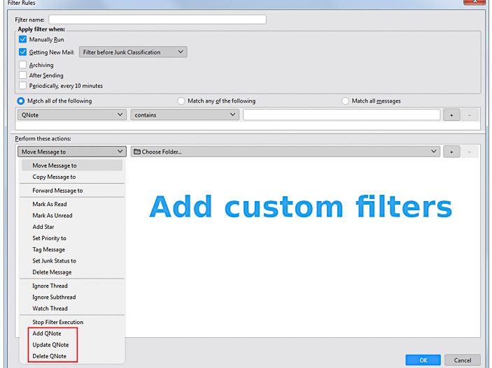
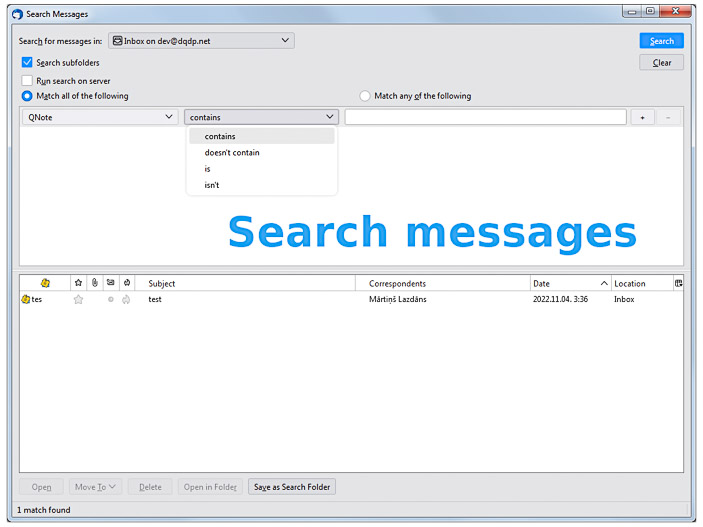

# Table of contents
1. [About](#about)
1. [Features](#features)
1. [Usage](#usage)
1. [Storage](#storage)
1. [Popup windows](#popup-windows)
1. [Screenshots](#screenshots)
1. [Building](#building)
1. [Releases](#releases)
1. [Known issues](#known-issues)
1. [Support](#support)
1. [Credits](#credits)


# About
This is the source code repository for the Thunderbird [QNote](https://addons.thunderbird.net/en-US/thunderbird/addon/qnote/) extension.

<p>
	
	
</p>

# Features
- Add "sticky" notes to email messages
- Save note position and size; multiple default note positions
- Search notes using Thunderbird's built-in search (Edit / Find / Search Messages)
- Filter and apply actions based on different conditions (Tools / Message Filters)
- Clipboard copy/paste
- Column with note icon and preview
- Bulk operations on multiple message selections: create, update, delete, reset, copy, paste
- Light and dark themes
- Multiple locales and localized date formats
- Tag messages when creating notes
- Fully compatible with [XNote++](https://addons.thunderbird.net/en-US/thunderbird/addon/xnotepp/) (3.0.0)
- Import / export between XNote++ (.xnote) and QNote (.qnote) file formats
- Supports Thunderbird versions, starting from 68.2.0 (check [archive](https://addons.thunderbird.net/en-US/thunderbird/addon/qnote/versions/) for latest supported version for your Thunderbird installation)
- Simple templating support

# Usage

- Press Alt+Q to open / save &amp; close the note
- Press ESC to close the note without saving
- Right-click on message(s) to access more commands in the context menu
- Use the built-in search to search within notes
- Use the built-in Filter Manager to create custom filters and actions

# Storage
There are two options for storing notes:

- Storing inside the extension (deprecated)
- Storing in a folder

Currently, there is no built-in mechanism for sharing notes across multiple computers. For now, in order to share notes across multiple computers, you could use shared folder solutions like Dropbox, NFS, or Windows/Samba shares.

If you are migrating from the XNote++ extension, you have two options: using the XNote++ folder directly or importing notes into the QNote folder. For more information, refer to the [migration guide](doc/migration-guide.md).

__If you are using internal storage, don't forget to export data before removing the extension.__

# Popup windows
There are two options for note windows:

- floating panel
- popup window

_Floating panel_ looks better but might not work well on all platforms. Fall back to _popup window_ if you experience difficulties with the _floating panel_. The _popup window_ uses Thunderbird's standard API.

# Screenshots
<p align="center" width="100%">


</p>
<p align="center" width="100%">


</p>
<p align="center" width="100%">


</p>

# Building
```
npm install
./node_modules/.bin/tsc
build.bat
```

All assets should now be placed in the `dist/release` folder if there are no errors.

Use `make_xpi.bat` to generate a `.xpi` ZIP file or point to `dist/release` as the source folder for `Tools / Developer Tools / Debug Add-ons`.

If you are using Linux, adjust `.bat` files to the appropriate Linux commands.

# Releases

Official releases are published on [addons.thunderbird.net](https://addons.thunderbird.net/en-US/thunderbird/addon/qnote/versions/) website.

# Known issues
- It does not work well together with the [Conversations](https://addons.thunderbird.net/en-US/thunderbird/addon/gmail-conversation-view/) extension.

# Support
Maintaining this extension requires a significant amount of time. If you find it useful, and you'd like to support its development, contributions in [EUR](https://www.paypal.com/donate/?hosted_button_id=CCFL84AMQKV4S) or [USD](https://www.paypal.com/donate/?hosted_button_id=NKF22QJS87LWN) via PayPal would be greatly appreciated.

# Credits
- Beautiful icons sourced from the [Gartoon Redux Action Icons Pack](https://www.iconarchive.com/show/gartoon-action-icons-by-gartoon-team.html)
- Date formatting is provided by the [Luxon](https://github.com/moment/luxon/) library
