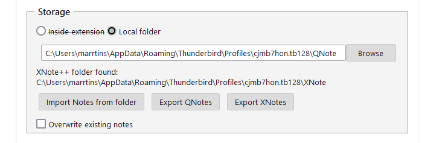

# How to Migrate from XNote++ (and Back)
1. [Using the Existing XNote++ Folder](#same-folder)
2. [Import XNote++ Files](#import-from-folder)
3. [Export as .xnote or .qnote Files](#export)

## Using the Existing XNote++ Folder
You can use the same folder where you saved XNote++ files. In this case, .xnote files will be automatically converted to .qnote files when you edit or delete them. Unchanged files will remain intact.

## Import XNote++ Files 
Go to Preferences, navigate to the Storage section, and click the "Import Notes from Folder" button. Next, select the folder containing your XNote++ or QNote files. Both .xnote and .qnote files will be imported into the currently selected storage option.

## Export as .xnote or .qnote Files 
If you wish to migrate back to XNote++ extensions, you can do so. Go to Preferences, navigate to the Storage section, and click the "Export QNotes" or "Export XNotes" buttons. Then, select the target folder. Notes will be exported from your current storage option (either "Inside extension" or "Local folder") to the selected target folder.
